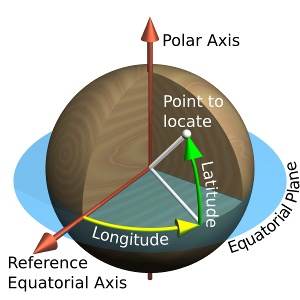
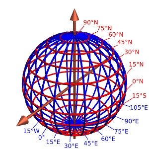
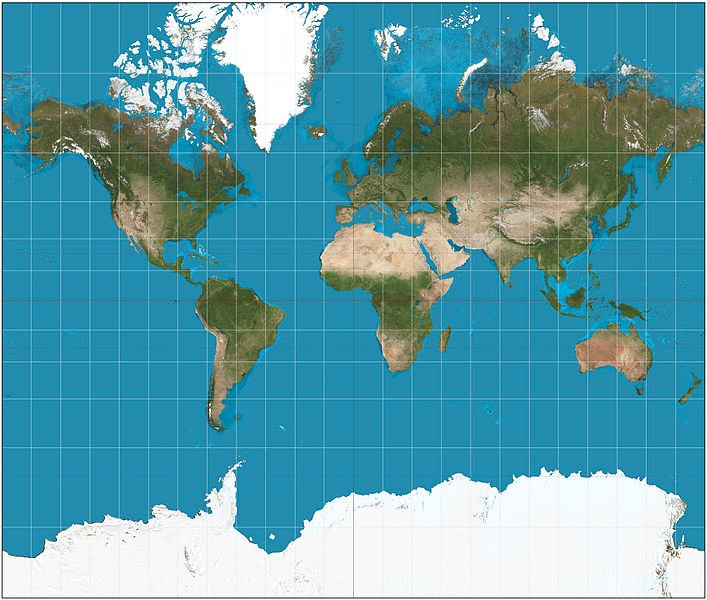

# Map Class
Created Wednesday 11 June 2014

Contact
=======

Email: [i@thejeshgn.com](mailto:i@thejeshgn.com)
<http://thejeshgn.com>

Earth
=====

* ☐ Shape  
	* ☐ Theoretically
		* ☐ Sphere 
	* ☐ Effect of gravity and rotation 
		* ☐ Spheroid or oblate ellipsoid
		* ☐ The equatorial diameter is nearly 1/300 longer than polar diameter
* ☐ Assuming surface has a constant radius, any point on it is uniquely identified using a polar two-coordinate system
* ☐ Selected parallels (in red) and meridians (in blue), here spaced 15° apart, comprise a spherical graticule.
* ☐ Longitude is measured from GMT, Latitude  from equator

[courtesy](http://www.progonos.com/furuti/MapProj/Normal/CartDef/cartDef.html)

Representaion of Earth
======================

* ☐ Map is a Representaion   [ Globe(3d) to Map(2D) ]
* ☐ Projection - Conversion process and logic
* ☐ A geodetic datum is a set of parameters (including axis lengths and offset from true center of the Earth) defining a reference ellipsoid. For each mapped region, a different datum can be carefully chosen so that it best matches average sea level, therefore terrain features.
* ☐ Maps are never free from errors
* ☐ Distance Measurement
	* ☐ Location
	* ☐ Area distortion
	* ☐ Shapes
	* ☐ Directions
* ☐ Mercator projection - cylindrical map projection

* ☐ [EPSG:4326](http://epsg.io/4326) refers to WGS84 earth as an ellipsoid
	* ☐ Has metric coordinates, uses lat and long
	* ☐ Used by GPS
	* ☐ WGS84 Bounds: -180.0000, -90.0000, 180.0000, 90.0000

 	

* ☐ For example bangalore is

* ☐ EPSG:900913 (EPSG:3857) Web Mercator refers to WGS84 earth is sphere 
	* ☐ Spherical mercator maps use an extent of the world from -180 to 180 longitude, and from -85.0511 to 85.0511 latitude
	* ☐ Projection bounds -20026376.39 -20048966.10	20026376.39 20048966.10
	* ☐ Initially by Google Maps for tiled maps
	* ☐ [Named](http://crschmidt.net/blog/archives/243/google-projection-900913/) by openlayers project - 'googlE' (substitute '9' for 'g' and squint a bit)
	* ☐ Originally rejected by standards body, then accepted with 3857
	* ☐ Used by OpenStreetMap and in general web
	* ☐ 

Data Type and Formats
=====================

* ☐ Raster
	* ☐ Images JPEG2000, GeoTIFF
* ☐ Vector
	* ☐ Point
	* ☐ Line, MultiLine
	* ☐ Polygon, Multipolygon
* ☐ Formats
	* ☐ [ShapeFile](http://en.wikipedia.org/wiki/Shapefile)
		* ☐ By ESRI
		* ☐ Package .shp (shape), .shx(index), .dbf (attributes) 
	* ☐ [Well Known Text](http://en.wikipedia.org/wiki/Well-known_text) (WKT)
		* ☐ Text format
		* ☐ Eg: POINT (30 10), LINESTRING (30 10, 10 30, 40 40)
* ☐ Web-Formats
	* ☐ KML
	* ☐ GeoJSON/TopoJSON

Maps Services
=============

* ☐ Tiled map service
	* ☐ URI in REST
	* ☐ Simpler than WMS
	* ☐ Google, OpenStreetMaps, MapQuest (OSM) or MapBox (OSM), ESRI

* ☐ Web Map Service
	* ☐ WMS
	* ☐ Serves georeferenced map images
	* ☐ Serves map in bitmap (PNG, GIF), Can also include vector maps like lines , served as SVG
	* ☐ Example, like [bhuwan](http://bhuvan.nrsc.gov.in) or [open weather map](http://openweathermap.org/api) for data

* ☐ SVG Based Maps
	* ☐ [Jvector Maps](http://jvectormap.com/)
	* ☐ [Polymaps](http://polymaps.org/)
	* ☐ You can manipulate the map the way you do SVG graphics
	* ☐ Can be use in conjunction with TMS or can be used independently
	* ☐ Works fine on modern web browsers

Tools
=====

* ☐ Desktop
	* ☐ QGIS
	* ☐ TillMill
* ☐ Web
	* ☐ [GeoJSON.io](http://geojson.io)
	* ☐ [Web Map APIs - LeafLet](http://leafletjs.com/) 
* ☐ Databases
	* ☐ Spatial DB (mostly spatial lite)
	* ☐ PostGIS

Available Data to experiment
============================

* ☐ Bangalore Data (Ward maps, BBMP election results, census data at BBMP level)
* ☐ BMTC Data (Bus stops and routes)
* ☐ BWSSB data (Water boundaries)
* ☐ PC and AC data, Election results

DO
==

* ☐ **Conversions**
	* ☐ Address to GeoCode
		* ☐ [GeoNames API](http://www.geonames.org/)
		* ☐ [In Google Docs](https://www.mapbox.com/tilemill/docs/guides/google-docs/)
		* ☐ [Google Places API](https://developers.google.com/places/documentation/)
	* ☐ GeoCode to Address
	* ☐ Raster to Vector
		* ☐ [Raster to Vector](http://manual.linfiniti.com/en/complete_analysis/raster_to_vector.html) is straight forward if the raster image has gis info ex: GeoTiff
		* ☐ [GeoReferecing](http://www.qgistutorials.com/en/docs/georeferencing_basics.html) 
	* ☐ Vector to Raster
		* ☐ Vector to Raster is easy
	* ☐ Expore different type of map file formats and conversions within QGIS or on web

* ☐ **With** **QGIS or Leaflet**
	* ☐ [Simple Choropleth](https://github.com/openbangalore/bangalore-heatmap) or On [Google Maps](https://github.com/thejeshgn/bangalore_choropleth) or [On Leaflet](http://leafletjs.com/examples/choropleth.html) 
	* ☐ Plotting points, lines and polygons 
	* ☐ HeatMap [QGIS](http://www.qgistutorials.com/en/docs/creating_heatmaps.html) or Leaflet  [BBMP maps](https://github.com/openbangalore/bmtc/tree/master/visualization) or 

* ☐ **GIS DB & GIS functions**
	* ☐ Find center of Polygons
		* ☐ Go to the menu -> Vector -> Geometry tools -> polygon centroid and create a centroid point layer
	* ☐ Find if a point is inside a polygon (which ward do i belong)
		* ☐ Intersect between points layer polygon layer
		* ☐ Join attributes by location
		* ☐ Add polygon attributes to points
		* ☐ Terraformer JS script 
		* ☐ SpatialLite DB  (spatialite_gui)

``select * from BBMP_wards_2011_region where  ST_Within(ST_GeomFromText("POINT(77.59456269966904 12.971598700795482)"),Geometry)``

	* ☐ Difference between layers
		* ☐ Old BBMP
		* ☐ New BBMP
* ☐ Intersection (common area)
	* ☐ BBMP
	* ☐ Pincode

Reading List
============

* ☐ <http://www.nuim.ie/staff/dpringle/gis/lectures.shtml>
* ☐ <http://courses.ncsu.edu/mea582/common/GIS_anal_lecture/GIS_Anal_Lectall.html>
* ☐ <http://www.progonos.com/furuti/MapProj/Normal/TOC/cartTOC.html>
* ☐ <https://github.com/veltman/learninglunches/tree/master/maps>
* ☐ <http://kartograph.org/>
* ☐ Tiled Map Servers, <http://www.liedman.net/tiled-maps/> 
* ☐ Projections <http://www.progonos.com/furuti/MapProj/Normal/TOC/cartTOC.html>
* ☐ Find user longitude and laltitude with out instruments <http://www.pbs.org/weta/roughscience/series1/challenges/latlong/>
* ☐ Finding longitude <http://astro.unl.edu/naap/motion1/tc_finding.html>
* ☐ <http://anitagraser.com/>
* ☐ <http://mc.bbbike.org/mc/?num=2&mt0=mapnik&mt1=toner>
* ☐ <http://openbangalore.org/>
* ☐ <http://leafletjs.com/plugins.html>

Contributing back to GIS community
==================================

* ☐ OSM
* ☐ Field Maps
* ☐ DataMeet.org
* ☐ GeoBlr

* ☐ **Plan**
	* ☐ Ask them what they want to know or do ❄
	* ☐ Ask them what they already know ❄
	* ☐ Map what they want to know   ↔  what you are going to cover
	* ☐ Cover
	* ☐ Point to resources for the extra/uncovered points

